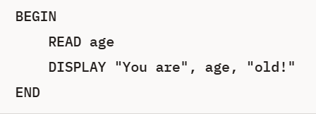

# Flowcharts

Flowcharts are diagrams that represent algorithms and are read from top to bottom and left to&#x20;

### Symbols&#xD;

Flowcharts use the following symbols connected by lines with arrowheads to indicate the flow of data. It is
&#x20;common practice to show arrowheads to avoid ambiguity.

<figure><figcaption></figcaption></figure>

Flowcharts using these symbols should be developed using only the standard control structures (as described
&#x20;in the following section, Control Structures).

### Input / Output Example

```
BEGIN 
    READ age
    DISPLAY "You are", age, "old!"
END
```

<div align="left"><figure><figcaption></figcaption></figure> <figure><figcaption></figcaption></figure></div>

### Decision Making (IF statements) Example

<div align="left"><figure><figcaption></figcaption></figure> <figure><figcaption></figcaption></figure></div>

### WHILE (Pre-Test) Loop Example

<div align="left"><figure><figcaption></figcaption></figure> <figure><figcaption></figcaption></figure></div>

### REPEAT UNTIL (Post-Test) Loop Example

Python doesn't do these as they are a pre-test loop, but you are expected to understand pseudocode alogrithms which could use them.

<div align="left"><figure><figcaption></figcaption></figure> <figure><figcaption></figcaption></figure></div>

### FOR / NEXT (Counted) Loop Example

<div align="left"><figure><figcaption></figcaption></figure> <figure><figcaption></figcaption></figure></div>








